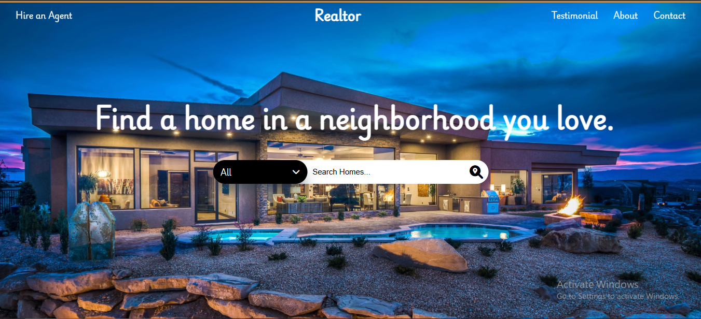
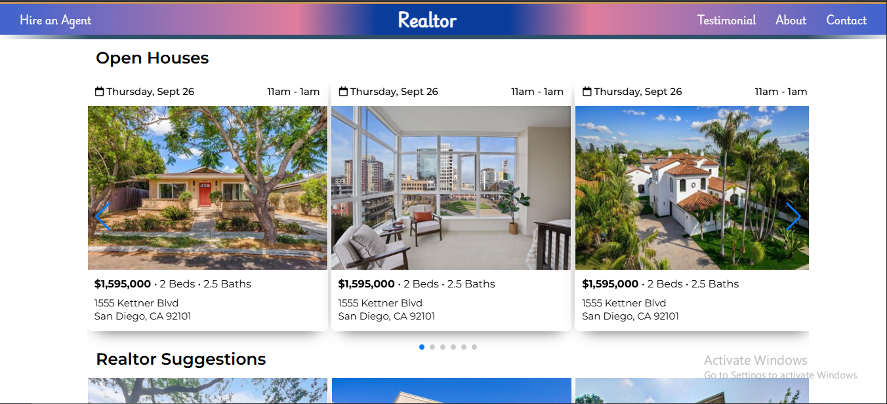
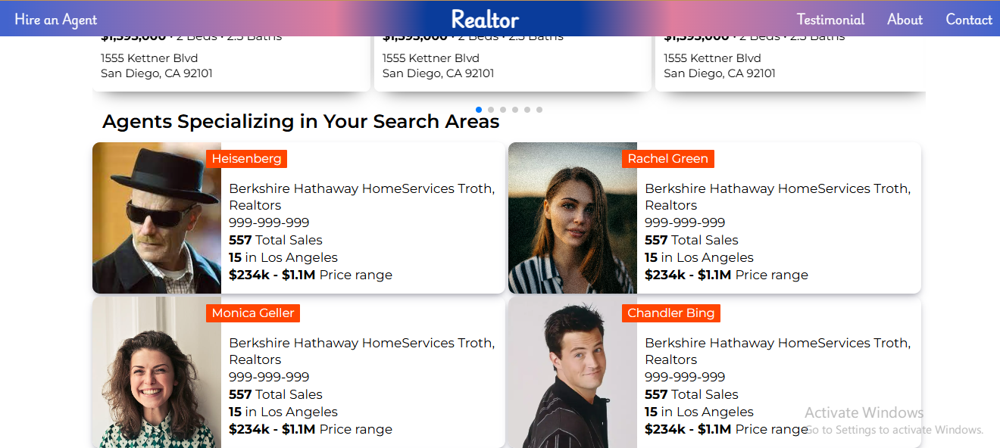

# 🏡 Realtor Website – Real Estate UI Clone

A fully responsive real estate website inspired by [Homes.com](https://www.homes.com/), built using **HTML**, **CSS**, and **JavaScript**. This project focuses on UI/UX, visual design, responsiveness, and interactive frontend features — designed for showcasing property listings in a modern, elegant layout.

## 🔥 Live Demo

👉 [Click Here to Visit the Live Site](https://aryanyashishere.github.io/realtor/)  

---

## 📸 Preview

---

## 🎯 Features

- ✨ **Modern Real Estate UI**: Beautiful homepage with large hero sections and featured listings  
- 📷 **Image Carousels**: Smooth sliding image banners (JavaScript-based)  
- 🔍 **Clean Navigation**: Header navigation with CTA and responsive behavior  
- 📱 **Responsive Design**: Optimized for desktop, tablet, and mobile viewports  
- 🏘️ **Listing Cards**: Custom-designed cards for displaying realtor listings  
- 🌄 **Background Imagery**: High-impact background visuals for better UX

---

## 🛠️ Tech Stack

- HTML5  
- CSS3 (custom styling)  
- JavaScript (Vanilla)  
- Responsive layout using media queries

---

---

## 🧠 What I Learned

- Implementing complex layouts with only HTML/CSS/JS
- Creating interactive elements using pure JavaScript (without frameworks)
- Designing pixel-perfect UI inspired by real-world sites
- Applying responsive design best practices using media queries

---

## 📌 Future Plans

- [ ] Add property search & filter functionality  
- [ ] Integrate property data from an API  
- [ ] Create realtor profile pages  
- [ ] Convert static version into React or Next.js

---

## 💬 Connect with Me

If you like this project or want to collaborate on frontend or full-stack ideas, feel free to connect!

 
📧 Email: aryanyashishere@gmail.com  
🌐 [LinkedIn](https://www.linkedin.com/in/aryan-yash-41b6a7256/)

---

